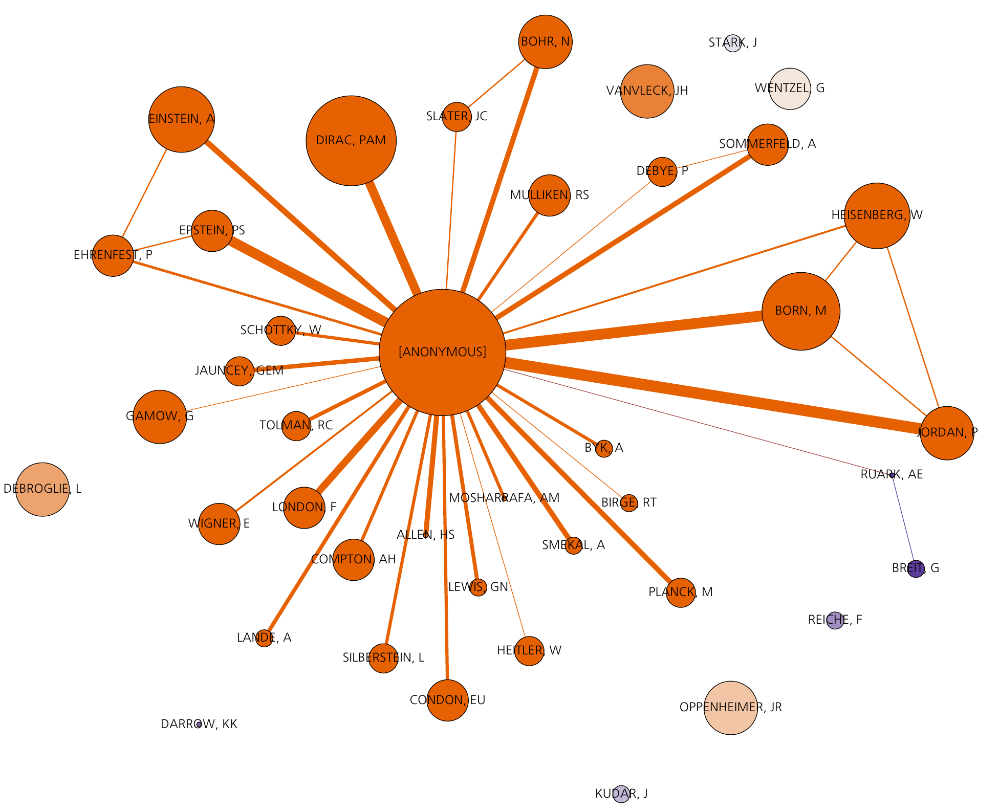

# collabworks
Build collaboration networks beetwen scientist based on references of WoS/Scopus databases. 

## Requirements

You need Python 3.2 or later to run collabworks. You can have multiple Python versions (2.x and 3.x) installed on the same system without problems.

In Ubuntu, Mint and Debian you can install Python 3 like this:

	sudo apt-get install python3 python3-pip

For other Linux flavors, OS X and Windows, packages are available [here](http://www.python.org/getit/).

Additionaly, the following Python packages are needed:
* Pandas
* NetworkX
* Numpy
* Unidecode

Which can be installed using [pip](https://docs.python.org/3/installing/). 

To install all the packages automatically (and ignore those already installed) you may just run the following line in a terminal,

	python3 -m pip install pandas networkx numpy unidecode

## Usage

### Obtain the data

First of all download all the data you want to visualize. 

#### Web of Science
Make a search of the articles from which you desire to study its publications structure.
Obtain afterwards the data selecting *Save to Tab-delimited (Windows, UTF-8)* and gathering the desired number of articles. No abstract is needed.
Download the bunch of files keeping in mind that WoS allows at most 500 articles for each txt file.
Place finally all the txt files into the 'data' folder contained in the execution directory.

#### Scopus 
Make a search of all the articles you would like to analyse. 
Obtain afterwards the data by selectind *Export*. In the tooltip select *CSV* and *citation information only*, since no abstract is needed.
Place finally all the csv files into the 'data' folder contained in the execution directory.

### Arguments and execution

Run the program using Python 3 by running the following line in a terminal within the execution directory,

	python3 collabworks.py *args

Depending on your environment the arguments may be,

* **-w**: All data is downloaded from WoS (default)
* **-s**: All data is downloaded from Scopus

The size of the nodes will be proportional to,

* **-a**: The number of articles per author
* **-c**: The number of citacions per author (default)

In order to drop non relevant authors a *publication threshold* has been defined, which may be understood as the number of publications
that some author must have so as to appear in the network. If some author has a number of articles lower than the one defined by the threshold, it will be automatically
dropped from the database. Thus,

* **publication_threshold** (integer): Integer defining the publication threshold (default: 1)

### Results
The script exports a GraphML file which can be visualized using [Gephi](https://gephi.org/).

## Example 
One example is presented for completeness. Supose we one to charcaterize the collaboration structure of the first scientist doing research on the field of Quantum mechanics. More concretely, we wish to know which were the collaboration communities which were talking about *quantum*s. We searched in the Web of Science for articles published between 1900 and 1930 under the topic *quantum*. We downloaded the 840 articles which appeared as search results. We placed them in the */data* folder and executed the program with the following arguments,

	python3 collabworks.py -c -w 5

Which means that the size of nodes will account for the number of citations per author (**-c**), that only WoS results are placed in the data folder (**-w**) and that our publication threshold is set to 5, meaning that only scientists with 5 or more articles will appear in the graph. Pressing *enter* the program automatically generated a file called *Graph [WoS - Threshold 5 - # Citations].graphml*, which can be opened in Gephi. With some basic knwoledge of this visualization tool, our graph will look like,

> Collaboration network of researchers publishing under the topic of *quantum*. The nodes size are proportional to the number of citations for an author.

Sadly, some guy called *[ANONYMOUS]* is getting all the attention, so relevant collaborations are hidden. Anyway, some of the most relevant physics of all time appear in the graph. 

